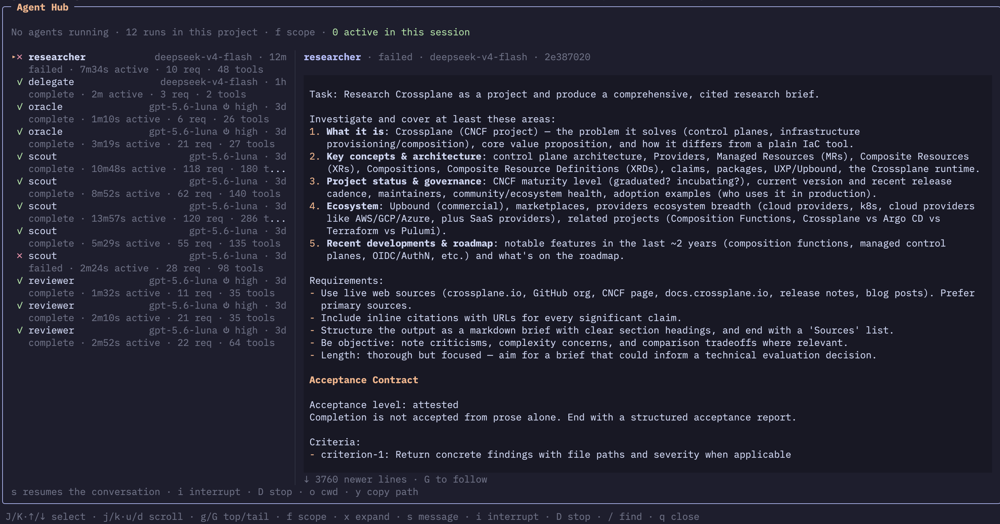

# pi-agent-hub

A hub inside [pi](https://github.com/earendil-works/pi) for watching the
agents that [pi-subagents](https://github.com/nicobailon/pi-subagents) runs in
the background — their **full conversations**, live, in one floating panel.



*The project moves quickly — the screenshot is here to give an idea and may
trail the latest version. Its look also owes to
[pi-omp-feel](https://github.com/bcanvural/pi-omp-feel): the hub renders
conversations through pi's own message components, so that theme reaches
inside the panel too.*

## Why

The runs' own transcript artifacts are lossy monitoring feeds — and often
absent entirely. But every child writes a **real pi session file**, the
complete record: thinking blocks, full markdown, tool calls with their
results and diffs. The hub tails that file and renders it through **pi's own
message components**, so a child's conversation looks exactly like the main
window — including whatever theming or framing other extensions apply to
those components.

Runs are discovered by scanning pi-subagents' artifact root — the only place
that records a run's id and its child's session file. Its versioned
cross-extension RPC (`subagents:rpc:v1:*` on pi's event bus) supplies the
liveness badge alongside. The roster opens scoped to **this session** — the agents this conversation
launched; `f` widens to the project (runs whose recorded cwd is the directory
pi runs in), then the whole machine. The strip names the scope in force.

## Requirements

- [pi](https://github.com/earendil-works/pi) ≥ 0.83 (developed against 0.84.x)
- [pi-subagents](https://github.com/nicobailon/pi-subagents) installed in the
  same pi — the hub speaks its versioned `v1` RPC and reads its run artifacts.
  Developed and verified against **0.46.x**; the protocol is capability-gated,
  and without the extension the hub still browses whatever artifacts exist,
  view-only.

## Use

```
pi install /path/to/pi-agent-hub        # or -l for one project
```

`/hub` — or `alt+a`, the omp reflex — opens the panel. `/hub 80` opens it at
80% of the terminal (any 40-100 sticks, saved to
`~/.pi/agent/pi-agent-hub.json`), and `z` cycles 50 → 60 → 80 → 100 live —
at 100 the panel is the screen. Each run shows what it
cost: pi prices every model call into the child's session file — assistant
turns, tool-result summaries, compactions — and the hub sums them by pi's own
accounting rule. Filled in gradually after opening, `…` while a sum is still
counting, and per conversation (a child's own spend, not its grandchildren's).

| key | action |
|---|---|
| `↑`/`↓` or `J`/`K` | select a run |
| `j`/`k`, `PgUp`/`PgDn` | scroll the conversation |
| `u`/`d` | half-page up / down |
| `g` / `G` | jump to the oldest retained record / back to the live tail |
| `s` / `enter` | message the run — steers it live, or resumes a finished one |
| `i` | interrupt (graceful, resumable) |
| `D D` | stop the run (asks once) |
| `x` / `X` / `ctrl+o` | expand or collapse tool output (for tools pi renders) |
| `/`, then `n`/`N` | search the conversation and walk the matches |
| `o` | open the child's working directory |
| `y` | copy the session file path |
| `f` | cycle scope: session → project → machine |
| `z` | cycle panel size: 50 → 60 → 80 → 100% |
| `r` | rescan runs |
| `q` / `esc` | back to your conversation |

## Status

Observing, messaging (steer / resume / interrupt / stop, with delivery labels
that say what actually happened), search, and the live output tail are all
implemented. `DESIGN.md` records the protocol facts this is built on and the
decisions behind them; `AGENTS.md` records the working invariants.
